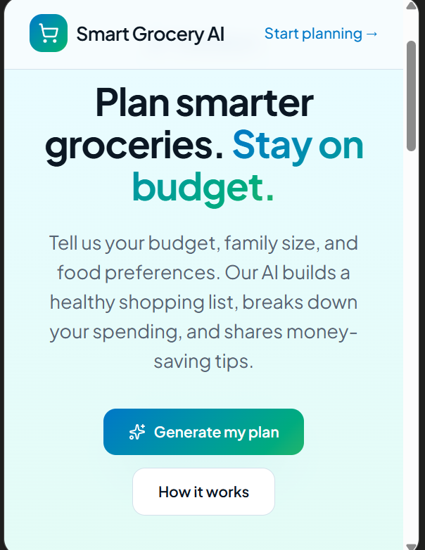
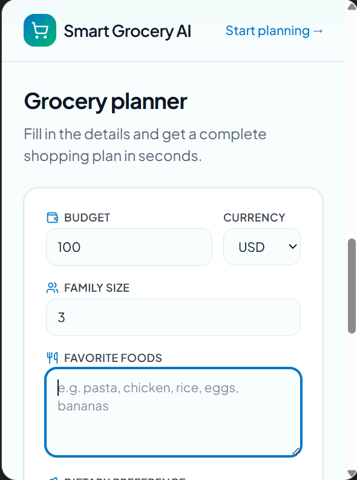
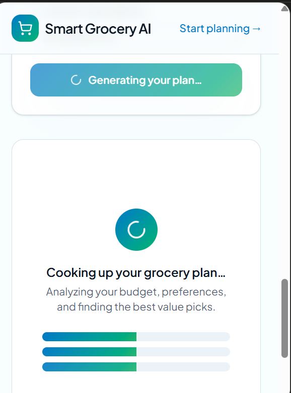
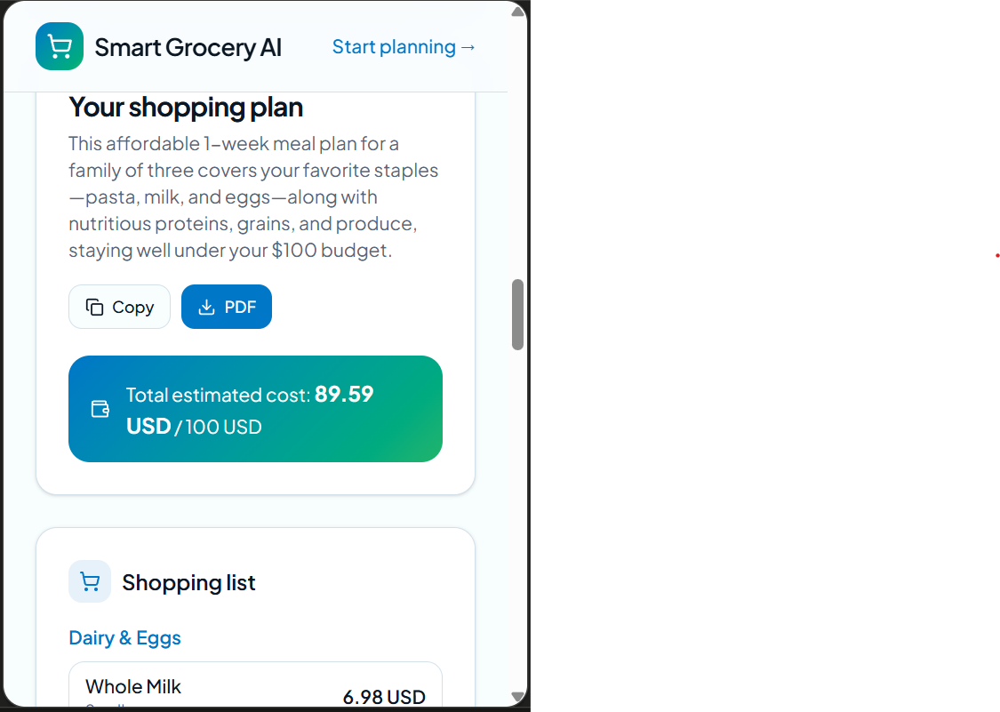
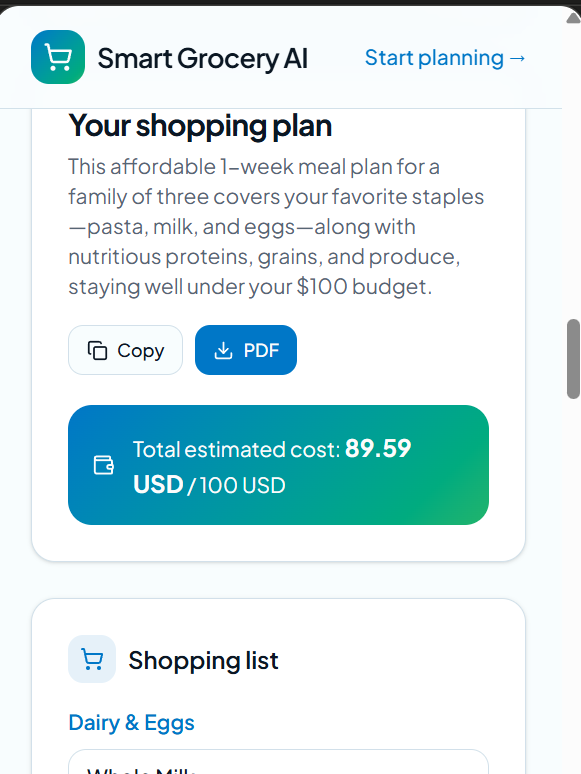

# Smart Grocery AI

## Overview
Smart Grocery AI is an AI-powered web application that helps users create a smart grocery shopping plan based on their budget, family size and food preferences. It reduces shopping time and helps users make cost-effective grocery decisions.

## Problem It Solves
Many people struggle to plan grocery shopping within their budget while maintaining a balanced diet. Smart Grocery AI provides personalized grocery recommendations using AI, making shopping easier and more affordable.

## Live Demo
**Live URL:** https://frugal-foods-ai.lovable.app

## Features
- AI-generated grocery shopping plans
- Budget-based recommendations
- Personalized suggestions based on family size
- Food preference customization
- Easy-to-use and responsive interface

## AI Feature
The application uses Google's Gemini AI to generate personalized grocery plans.

### System Prompt
"You are an AI grocery shopping assistant. Create a practical grocery shopping plan based on the user's budget, family size, and food preferences. Recommend affordable, healthy items and provide money-saving shopping tips."

## Technologies Used
- Lovable
- React
- TypeScript
- Google Gemini Flash
- GitHub

## Screenshots

### Home Page

### User Input

### AI Generating Plan

### Generated Grocery Plan

### PDF Export

## How to Run the Project

1. Clone the repository.
2. Install dependencies.
3. Configure the Gemini API key.
4. Run the development server.
5. Open the application in your browser.

## Future Improvements
- Shopping list export
- Price comparison
- Nearby grocery store recommendations
- User accounts and saved shopping plans

## Author
Maheen Sammad, 
The Women University Multan
Developed as an individual final project.
